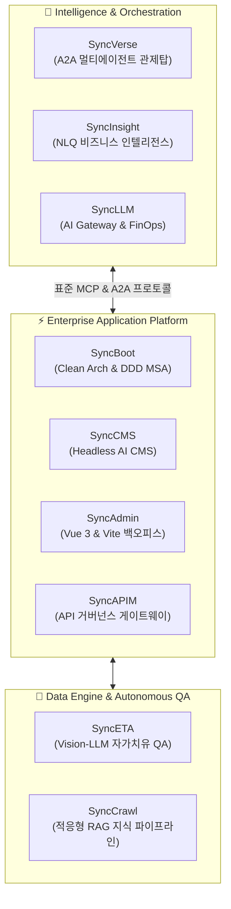

<div align="center">

# ㈜엠파시 (Empasy Inc.)
### **"Boon to Business by Agility — AI 자율 운영 생태계를 이끄는 Living Software"**

[](https://empasy.io)
[](https://doc.empasy.com)
[](https://github.com/empasy)
[](mailto:contact@empasy.com)

<br/>

**㈜엠파시(Empasy)**는 'Empathic Synergy(공감과 협업의 시너지)'를 바탕으로,  
변화에 민첩하게 반응하고 스스로 진화하는 **엔터프라이즈 AI 자율 운영 생태계(Living Software)**를 구축합니다.  
표준 **MCP(Model Context Protocol)**와 클라우드 네이티브 아키텍처를 결합하여 기획·개발·QA·운영 전 주기를 혁신합니다.

</div>

---

### 🌐 The Sync Series Ecosystem (3-Layer Architecture)

엠파시의 **Sync Series**는 분산된 도메인 에이전트들이 유기적으로 협업하는 통합 엔터프라이즈 솔루션 라인업입니다.



---

### ⚡ Core Solutions & Platforms

| Solution | Layer & Role | Key Capabilities & Architecture | Docs & Link |
| :--- | :--- | :--- | :---: |
| **SyncVerse** | AI Orchestration | • 표준 MCP 기반 도메인 에이전트 자율 협업 오케스트레이션<br>• 자연어 의도 기반 지능형 라우팅 및 6-Step AI DLC 라이프사이클<br>• 1-Click HITL(Human-in-the-Loop) 거버넌스 및 Saga 분산 트랜잭션 | [SyncVerse 가이드](https://doc.empasy.com/syncverse/) |
| **SyncInsight** | Decision Intelligence | • 엔터프라이즈 데이터 실시간 스트리밍 분석 및 Anomaly Detection<br>• 자연어 질의 기반 맞춤형 데이터 시각화 (NL2SQL & Context-Aware RAG)<br>• 시스템 자원 및 FinOps 토큰 비용 통합 모니터링 | [SyncInsight 가이드](https://doc.empasy.com/syncinsight/) |
| **SyncETA** | Autonomous QA | • Vision-LLM 기반 화면 요소 재식별 및 셀렉터 자가 치유(Self-Healing)<br>• 엑셀(Excel) 테스트케이스 직결 실행 & 노코드 GUI 테스트<br>• CI/CD 무인 회귀 테스트 파이프라인 및 비디오 실행 리포트 | [SyncETA 가이드](https://doc.empasy.com/synceta/) |
| **SyncCrawl** | Adaptive Web & RAG | • DOM 구조 변경에 자율 대응하는 고적응형 웹 수집 엔진<br>• 안티봇 우회(지능형 프록시 순환) 및 정형 JSON 스키마 자동 추출<br>• 엔터프라이즈 RAG 구축을 위한 벡터 DB 실시간 파이프라인 | [SyncCrawl 가이드](https://doc.empasy.com/synccrawl/) |
| **SyncBoot** | Cloud-Native MSA | • Spring Boot 기반 Clean Architecture & 도메인 주도 설계(DDD)<br>• AI Schema Studio 로우코드 생성기 및 권한/워크플로우 내장<br>• OWASP Top 10 보안 표준 및 ELK 분산 로깅 완비 | [SyncBoot 가이드](https://doc.empasy.com/syncboot/) |
| **SyncCMS** | Enterprise AI CMS | • 15개국 이상 다국어 및 멀티 도메인 통합 관리 엔진<br>• 마케터/운영자를 위한 직관적 노코드 라이브 빌더 & SEO 최적화<br>• Live SDK 연동 및 온프레미스 AI 보안 환경 지원 | [SyncCMS 가이드](https://doc.empasy.com/synccms/) |
| **SyncLLM** | Enterprise AI Gateway | • 멀티 LLM 지능형 라우팅 및 실시간 토큰 비용 제어(FinOps)<br>• 시맨틱 캐싱(Semantic Caching) 및 엔터프라이즈 PII 마스킹 | [SyncLLM 가이드](https://doc.empasy.com/syncllm/) |
| **SyncAdmin** | Admin UI Framework | • Vue 3, Vite, TypeScript 기반 고성능 템플릿<br>• 모듈화된 반응형 컴포넌트 및 초고속 프론트엔드 개발 환경 | [SyncAdmin 가이드](https://doc.empasy.com/syncadmin/) |
| **SyncAPIM** | API Management | • 엔터프라이즈 API 생성·배포·보안·모니터링 전 주기 통합 관리<br>• OAuth 2.0 / JWT 기반 다층 보안 및 트래픽 제어 정책 거버넌스 | [SyncAPIM 가이드](https://doc.empasy.com/syncapim/) |

---

### 🏢 Proven Enterprise Track Record (검증된 레퍼런스)

엠파시는 대규모 트래픽과 높은 신뢰성이 요구되는 미션 크리티컬 엔터프라이즈 환경에서 기술력을 입증해 왔습니다.

* 🎓 **비상교육 (AIDT 플랫폼)**: 실시간 동시 접속 2,000명 규모 교육 플랫폼에 `SyncETA` 도입 ➔ **수작업 QA 공수 80% 절감, 회귀 테스트 시간 4시간 → 45분 단축**
* 🚗 **아우토크립트 & 현대자동차 (vSoC 차량 관제)**: 대규모 텔레매틱스 데이터 파이프라인 구축 ➔ **초당 10,000+ 패킷 무지연 처리 및 실시간 이상 탐지**
* 🛒 **홈플러스 (차세대 MIS 시스템)**: `SyncBoot` 프레임워크 기반 클라우드 네이티브 MSA 전면 전환 ➔ **Saga 분산 트랜잭션 패턴 적용 및 비즈니스 정합성 확보**
* 🛡️ **펜타시큐리티 (WAPPLES API Security)**: `SyncBoot` + `OpenSearch` 결합 ➔ **대규모 API 트래픽 무지연 인덱싱 및 멀티 클라우드 관제 엔진 구축**
* ☁️ **효성ITX (엔터프라이즈 데이터 파이프라인)**: AKS(Azure Kubernetes) 분산 클러스터 기반 **Playwright 멀티 워커 웹 수집 및 RAG 지식 자산화**
* 🌐 **LX하우시스 / SK매직 / KT / 한전**: 글로벌 다국어 커머스 웹 구축 및 대기업 엔터프라이즈 시스템 운영·유지보수

---

### 🛠 Technology Stack

```
AI & Multi-Agent │ AgentScope Java, Model Context Protocol (MCP), LangChain, Vision-LLM, RAG
Backend          │ Java 17/21, Spring Boot 3, Spring Cloud, MyBatis/JPA, Redis, Kafka, RabbitMQ
Frontend         │ Vue 3, Vite, TypeScript, Pinia, Element Plus, TailwindCSS
Data & Search    │ PostgreSQL, MySQL, OpenSearch, ElasticSearch, Chroma / Milvus (Vector DB)
DevOps & Cloud   │ Docker, Kubernetes (AKS/EKS), Jenkins, GitHub Actions, AWS, Azure, Linux
QA & Automation  │ Playwright, Selenium, Chromium Automation Engine (SyncETA)
```

---

### 💼 Business Capabilities

1. **AI & Solution Ecosystem**: Sync Series 공급, 맞춤형 AI 에이전트 구축 및 온프레미스 최적화
2. **System Integration (SI)**: 클라우드 네이티브 MSA 분석/설계, 엔터프라이즈 시스템 신속 구축
3. **IT Outsourcing (ITO)**: 대규모 트래픽 및 보안 규정 준수 시스템의 안정적 24/7 유지보수
4. **Architecture Consulting**: DevOps, FinOps 비용 최적화, 정보화 전략(ISP) 및 A2A 전환 컨설팅

---

### 🔗 Explore & Connect

- **공식 홈페이지**: [https://empasy.io](https://empasy.io)
- **개발자 기술 문서**: [https://doc.empasy.com](https://doc.empasy.com)
- **비즈니스 제휴 및 솔루션 도입 문의**: [contact@empasy.com](mailto:contact@empasy.com)

<div align="right">
<sub>Copyright © 2026 Empasy Inc. All rights reserved.</sub>
</div>
