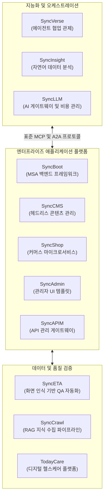

# 주식회사 엠파시 (Empasy Inc.)

기업 업무 환경에 맞춘 AI 멀티 에이전트와 클라우드 네이티브 솔루션을 개발합니다.

 

엠파시는 엔터프라이즈 환경에서 안정적으로 동작하는 AI 자율 운영 솔루션(SyncSeries)을 개발합니다.  
표준 프로토콜(Model Context Protocol, MCP) 기반의 에이전트 연동 기술과 대규모 트래픽을 처리하는 클라우드 아키텍처를 바탕으로  
기획, 개발, 데이터 파이프라인, 품질 검증의 자동화를 지원합니다.

---

### SyncSeries 아키텍처 구성

SyncSeries는 도메인별 독립 모듈과 AI 에이전트가 유기적으로 연계되어 동작하는 엔터프라이즈 솔루션 라인업입니다.

---

### 주요 솔루션 및 플랫폼

| 솔루션 | 구분 및 역할 | 주요 기능과 특징 | 문서 |
| :--- | :--- | :--- | :--- |
| **SyncVerse** | AI 협업 관제 | 표준 MCP 기반 도메인 에이전트 연동, 사용자 의도 기반 작업 라우팅, 작업 승인(HITL) 거버넌스 | [문서 보기](https://doc.empasy.com/syncverse/) |
| **SyncInsight** | 비즈니스 인텔리전스 | 자연어 질의 기반 맞춤형 데이터 조회(NL2SQL), 실시간 스트리밍 지표 분석 및 이상 감지 | [문서 보기](https://doc.empasy.com/syncinsight/) |
| **SyncETA** | QA 자동화 | 화면 UI 인식 기반 요소 탐색, 엑셀 테스트케이스 직결 실행, CI/CD 무인 회귀 테스트 | [문서 보기](https://doc.empasy.com/synceta/) |
| **SyncCrawl** | 데이터 수집 엔진 | 웹 페이지 구조 변화에 대응하는 데이터 수집, 정형 JSON 변환 및 RAG 벡터 DB 파이프라인 | [문서 보기](https://doc.empasy.com/synccrawl/) |
| **SyncBoot** | MSA 프레임워크 | Spring Boot 기반 클린 아키텍처 및 DDD 지원, 권한/워크플로우 내장, 엔터프라이즈 보안 표준 | [문서 보기](https://doc.empasy.com/syncboot/) |
| **SyncShop** | 커머스 플랫폼 | 마이크로서비스 독립 구조(Admin, Portal, Gateway, Search), 마진 보호 로직, 시맨틱 상품 검색 | [문서 보기](https://doc.empasy.com/syncshop/) |
| **SyncCMS** | 콘텐츠 관리 | 다국어 및 멀티 도메인 지원, 컴포넌트 기반 화면 빌더, 실시간 미리보기 및 SEO 최적화 | [문서 보기](https://doc.empasy.com/synccms/) |
| **SyncLLM** | AI 게이트웨이 | 다중 LLM 라우팅, 토큰 사용량 및 비용 모니터링, 시맨틱 캐싱, 개인정보 마스킹 | [문서 보기](https://doc.empasy.com/syncllm/) |
| **TodayCare** | 헬스케어 DX | 시니어 일상 케어 및 복약 관리 모바일 앱, 패밀리 보호자 앱, 센터 관리자 시스템 | [문서 보기](https://empasy.io) |
| **SyncAdmin** | UI 프레임워크 | Vue 3, Vite, TypeScript 기반의 반응형 백오피스 템플릿과 표준 컴포넌트 라이브러리 | [문서 보기](https://doc.empasy.com/syncadmin/) |
| **SyncAPIM** | API 관리 | 엔터프라이즈 API 생성, 배포, 접근 제어, 사용량 제한 및 모니터링 관리 | [문서 보기](https://doc.empasy.com/syncapim/) |

---

### 주요 구축 및 프로젝트 레퍼런스

- **비상교육 (AIDT 교육 플랫폼)**: 동시 접속 2,000명 규모 교육 환경에 QA 자동화(SyncETA)를 도입하여 회귀 테스트 시간을 4시간에서 45분으로 단축하고 수작업 검증 과정을 효율화했습니다.
- **아우토크립트 & 현대자동차 (vSoC 차량 관제)**: 대규모 텔레매틱스 데이터 파이프라인을 구축하여 초당 1만 건 이상의 차량 관제 데이터를 지연 없이 처리하고 실시간 이상 징후를 감지하도록 구현했습니다.
- **홈플러스 (차세대 MIS 시스템)**: SyncBoot 기반의 클라우드 네이티브 MSA 전환을 지원하고, Saga 분산 트랜잭션 설계를 적용하여 비즈니스 데이터의 정합성을 보장했습니다.
- **펜타시큐리티 (WAPPLES API Security)**: SyncBoot 프레임워크와 OpenSearch를 연계하여 대용량 API 트래픽 인덱싱 및 멀티 클라우드 관제 엔진을 구축했습니다.
- **효성ITX (엔터프라이즈 데이터 파이프라인)**: AKS 환경 기반의 분산 브라우저 수집 파이프라인을 구현하고 엔터프라이즈 RAG 구축을 위한 데이터 자산화를 지원했습니다.
- **엔터프라이즈 시스템 구축 및 운영**: LX하우시스, SK매직, KT, 한전 등 다수 기업의 대규모 서비스 개발, 다국어 커머스 구축, 운영 관리를 수행했습니다.

---

### 기술 스택

- **AI 및 에이전트**: AgentScope Java, Model Context Protocol (MCP), LangChain, Vision-LLM, RAG
- **백엔드**: Java 21 / 25, Spring Boot 3, Spring Cloud, PostgreSQL 17 (pgvector), Redis, Kafka, RabbitMQ
- **프론트엔드**: Vue 3, Vite, TypeScript, Pinia, Vben Admin, TailwindCSS
- **인프라 및 클라우드**: Docker, Kubernetes (AKS/EKS), Jenkins, GitHub Actions, AWS, Azure, Linux
- **품질 관리**: Playwright, Selenium, Chromium Automation Engine (SyncETA)

---

### 주요 사업 영역

1. **AI 솔루션 및 플랫폼 공급**: SyncSeries 공급, 엔터프라이즈 AI 에이전트 구축 및 온프레미스 최적화
2. **시스템 구축 (SI)**: 클라우드 네이티브 MSA 분석 및 설계, 대규모 비즈니스 시스템 신속 구축
3. **시스템 운영 및 관리 (ITO)**: 24/7 시스템 안정성 확보, 성능 튜닝, 보안 규정 준수 관리
4. **아키텍처 컨설팅**: 마이크로서비스 전환, FinOps 클라우드 비용 최적화, A2A 협업 모델 수립

---

### 문의 및 링크

- 공식 웹사이트: [https://empasy.io](https://empasy.io)
- 개발자 기술 문서: [https://doc.empasy.com](https://doc.empasy.com)
- 비즈니스 제휴 및 솔루션 도입 문의: [contact@empasy.com](mailto:contact@empasy.com)

Copyright © 2026 Empasy Inc. All rights reserved.

